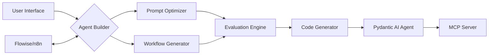

# ARCHON Low-Code Platform

🚀 **Build AI Agents Visually with ARCHON's Dual-Evolution Architecture**

ARCHON Low-Code Platform is a visual development environment that makes creating sophisticated AI agents accessible to everyone. Build Pydantic AI agents using drag-and-drop interfaces, pre-built templates, and MCP (Model Context Protocol) integration.

## 🌟 Key Features

- **Visual Agent Builder**: Create AI agents with no coding required
- **Dual-Agent Evolution**: Leverages ARCHON's prompt optimizer and workflow generator
- **MCP Integration**: Seamless connection to Model Context Protocol servers
- **Pre-built Templates**: Start with ready-to-use agent templates
- **Tool Library**: Rich collection of pre-built tools for common tasks
- **n8n/Flowise Integration**: Visual workflow design and execution
- **Pydantic AI Output**: Generates production-ready Python code

## 🏗️ System Architecture



## 🚀 Quick Start

### Prerequisites

- Docker and Docker Compose
- Python 3.9+
- Node.js 16+

### Installation

```bash
# Clone the repository
git clone https://github.com/mows21/archon-lowcode-platform.git
cd archon-lowcode-platform

# Start all services
docker-compose up -d

# Access the UI
open http://localhost:8000
```

### Creating Your First Agent

1. Open the ARCHON Builder at http://localhost:8000
2. Choose an agent template (Basic, API, Data Processing)
3. Configure your agent's purpose and behavior
4. Select tools from the library
5. Configure MCP server connections
6. Generate and download your Pydantic AI agent

## 📦 Project Structure

```
archon-lowcode-platform/
├── 🤖 agent-builder/          # Agent creation system
│   ├── templates/             # Agent templates
│   ├── tools/                 # Pre-built tool library
│   └── examples/              # Example agents
├── 🌊 flowise-integration/    # Flowise flow configurations
├── 🔄 n8n-integration/        # n8n orchestration workflows
├── 🎨 no-code-ui/            # Visual builder interface
├── 🐳 docker/                # Container configurations
└── 📚 docs/                  # Documentation
```

## 💡 Use Cases

### 1. Customer Support Agent
```python
# Generated with ARCHON Builder
agent = Agent(
    'gpt-4',
    system_prompt="You are a helpful customer support agent...",
    tools=[ticket_system, knowledge_base, email_sender]
)
```

### 2. Data Processing Agent
```python
# Connects to MCP databases
agent = Agent(
    'claude-3-haiku',
    system_prompt="Process and analyze data efficiently...",
    mcp_servers=[postgres_server, mongodb_server]
)
```

### 3. Web Automation Agent
```python
# Browser automation with Roo server
agent = Agent(
    'gpt-4',
    system_prompt="Automate web tasks intelligently...",
    mcp_servers=[roo_automation_server]
)
```

## 🛠️ Components

### 1. Agent Builder
- Visual agent configuration
- Tool selection interface
- MCP server management
- Code preview and export

### 2. Template Library
- Basic agent template
- API integration template
- Data processing template
- Automation agent template

### 3. Tool Library
- Database operations
- Web scraping tools
- File management
- Communication tools
- API integrations

### 4. MCP Integration
- Server configuration helpers
- Connection management
- Tool discovery system

## 🔄 Workflow

1. **Design**: Use visual interface to design agent
2. **Configure**: Select tools and MCP connections
3. **Generate**: Convert visual design to Pydantic AI code
4. **Deploy**: Run agent locally or containerized
5. **Monitor**: Track performance with built-in analytics

## 📚 Documentation

- [Architecture Guide](./docs/ARCHITECTURE.md)
- [Getting Started](./docs/GETTING_STARTED.md)
- [Template Guide](./docs/TEMPLATES.md)
- [Tool Reference](./docs/TOOLS.md)
- [MCP Integration](./docs/MCP_INTEGRATION.md)
- [API Reference](./docs/API_REFERENCE.md)

## 🤝 Contributing

We welcome contributions! Please see our [Contributing Guide](./CONTRIBUTING.md) for details.

### Development Setup

```bash
# Create development environment
python -m venv venv
source venv/bin/activate
pip install -r requirements-dev.txt

# Run tests
pytest tests/

# Start development servers
make dev
```

## 📝 License

MIT License - see [LICENSE](./LICENSE) file for details.

## 🔗 Related Projects

- [mcp-agent-servers](https://github.com/mows21/mcp-agent-servers) - Core MCP server implementations
- [Pydantic AI](https://github.com/pydantic/pydantic-ai) - Type-safe AI agent framework
- [Flowise](https://flowiseai.com/) - Visual LLM workflow builder
- [n8n](https://n8n.io/) - Workflow automation platform

## 👥 Team

Built with ❤️ by the ARCHON team

## 🙏 Acknowledgments

- OpenAI for GPT models
- Anthropic for Claude
- The open-source AI community

---

🚀 **Start building intelligent AI agents today!**
