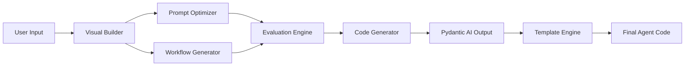
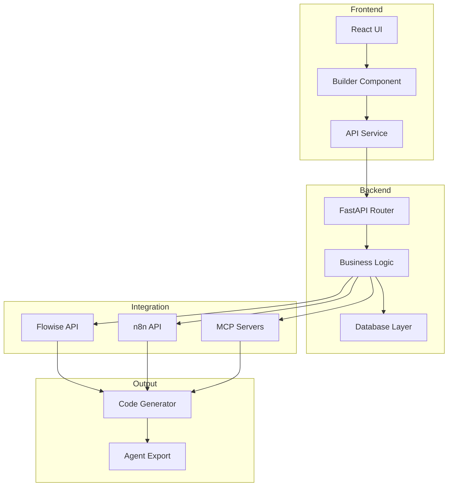

# ARCHON Low-Code Platform Architecture

## Overview

The ARCHON Low-Code Platform implements a sophisticated architecture that enables visual creation of AI agents using dual-evolution principles. The system transforms natural language requirements into production-ready Pydantic AI agents through an intuitive visual interface.

## Core System Design

### 1. Visual Builder Layer

The front-end provides drag-and-drop interfaces for:
- Agent configuration
- Tool selection from pre-built library
- MCP server integration
- Visual workflow design
- Code generation and export

### 2. Dual-Agent Evolution Engine

#### 2.1 Prompt Optimizer Agent
- Analyzes user requirements for completeness
- Identifies optimal prompt structures
- Generates clarifying questions
- Evolves prompt patterns through feedback

#### 2.2 Workflow Generator Agent  
- Translates natural language to agent structures
- Validates workflow logic
- Optimizes tool integration
- Handles error scenarios

### 3. Integration Layer

#### 3.1 Flowise Integration
- Visual AI flow design
- Node-based workflow creation
- LangChain integration
- Custom node development

#### 3.2 n8n Integration
- Workflow orchestration
- API automation
- Event-driven processing
- Code generation pipeline

### 4. MCP Server Integration

The platform connects to multiple MCP servers:
- **Cline**: Internal workflow orchestration
- **Roo**: External automation and web tasks
- **Claude Desktop**: Local desktop operations
- **Custom**: User-defined MCP servers

### 5. Code Generation Pipeline



### 6. Data Storage Architecture

#### 6.1 Vector Database (Qdrant)
- Agent template storage
- Pattern recognition database
- Similarity search for workflow optimization

#### 6.2 Relational Database (Supabase)
- User configurations
- Agent metadata
- Performance metrics
- Learning history

### 7. Development Workflow

```mermaid
sequence
    participant UI as Visual Builder
    participant FW as Flowise
    participant N8N as n8n
    participant MCP as MCP Servers
    participant CODE as Code Generator
    
    UI->>FW: Create visual flow
    FW->>N8N: Process workflow
    N8N->>MCP: Execute operations
    MCP->>CODE: Generate agent
    CODE->>UI: Return Pydantic AI code
```

### 8. Component Architecture

```
archon-lowcode-platform/
├── frontend/                   # React-based UI
│   ├── components/            # React components
│   ├── services/              # API integration
│   └── hooks/                 # Custom React hooks
│
├── backend/                   # FastAPI services
│   ├── api/                   # REST endpoints
│   ├── core/                  # Business logic
│   └── db/                    # Database connections
│
├── flowise/                   # Flowise configurations
│   ├── flows/                 # Pre-built flows
│   └── nodes/                 # Custom nodes
│
├── n8n/                       # n8n workflows
│   ├── orchestration/        # Main workflows
│   └── templates/            # Workflow templates
│
└── mcp-integration/          # MCP server configs
    ├── cline/                # Cline server
    ├── roo/                  # Roo server
    └── claude-desktop/       # Claude Desktop
```

### 9. Security Architecture

- **Authentication**: JWT-based authentication
- **Authorization**: Role-based access control
- **Data Encryption**: At-rest and in-transit
- **API Security**: Rate limiting, input validation
- **Container Security**: Docker isolation

### 10. Scalability Design

- **Horizontal Scaling**: Microservices architecture
- **Load Balancing**: Nginx reverse proxy
- **Caching**: Redis for performance
- **Async Processing**: Celery task queue
- **Database Sharding**: Distributed data storage

### 11. Monitoring and Analytics

- **Performance Metrics**: Prometheus/Grafana
- **Error Tracking**: Sentry integration
- **Usage Analytics**: Custom dashboard
- **Audit Logging**: ELK stack
- **Agent Performance**: LangFuse integration

### 12. Deployment Architecture

```yaml
# Docker Compose overview
services:
  frontend:
    build: ./frontend
    ports: ["8000:80"]
  
  backend:
    build: ./backend
    ports: ["8080:8080"]
  
  flowise:
    image: flowiseai/flowise
    ports: ["3000:3000"]
  
  n8n:
    image: n8nio/n8n
    ports: ["5678:5678"]
  
  qdrant:
    image: qdrant/qdrant
    volumes: ["qdrant_data:/qdrant/storage"]
  
  supabase:
    image: supabase/postgres
    volumes: ["postgres_data:/var/lib/postgresql/data"]
```

### 13. API Design

#### REST Endpoints
```
/api/v1/agents           # Agent CRUD operations
/api/v1/templates        # Template management
/api/v1/tools            # Tool library access
/api/v1/mcp              # MCP server configuration
/api/v1/generate         # Code generation
/api/v1/deploy           # Agent deployment
```

#### WebSocket Events
```
agent:created            # New agent creation
agent:updated            # Agent modification
generation:started       # Code generation begin
generation:completed     # Code generation finish
error:occurred           # Error notification
```

### 14. Development Stack

- **Frontend**: React 18, TypeScript, TailwindCSS
- **Backend**: FastAPI, Python 3.11, SQLAlchemy
- **Databases**: PostgreSQL, Qdrant, Redis
- **Orchestration**: Docker, Kubernetes (optional)
- **CI/CD**: GitHub Actions, Docker Registry
- **Testing**: Jest, Pytest, Cypress

### 15. Data Flow Diagram



This architecture ensures scalability, maintainability, and extensibility while providing a seamless developer experience for creating AI agents without coding expertise.
